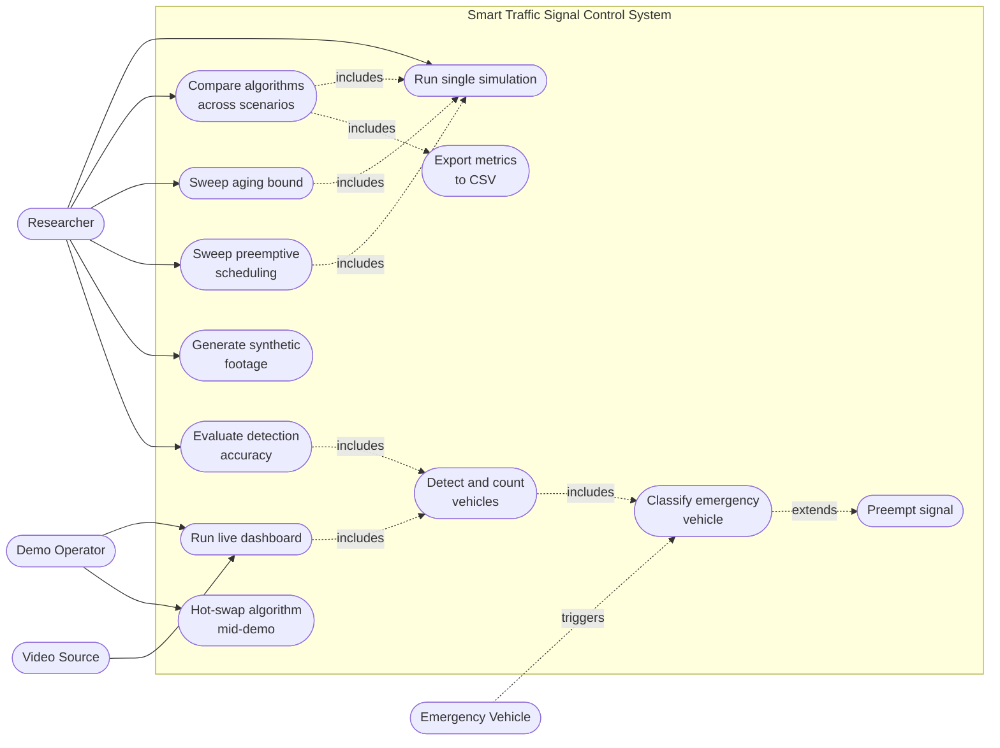
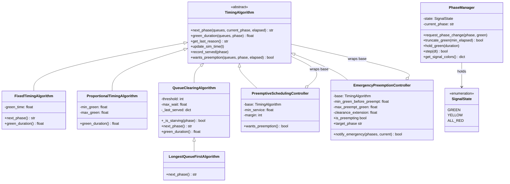
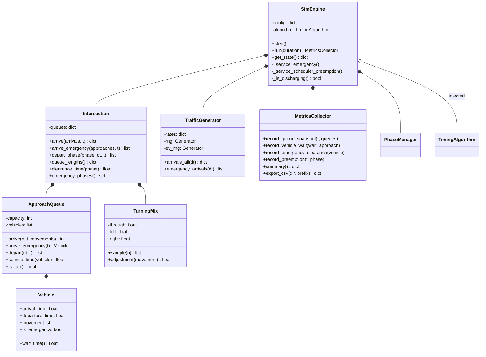
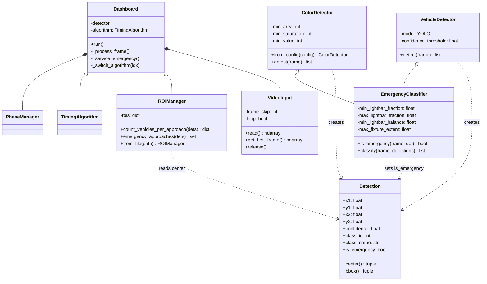
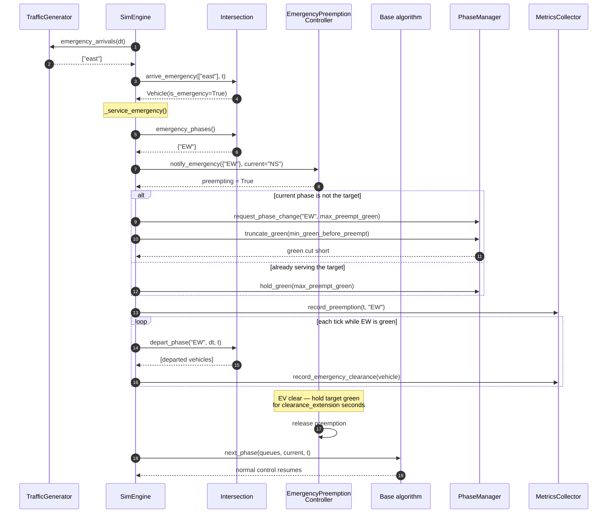
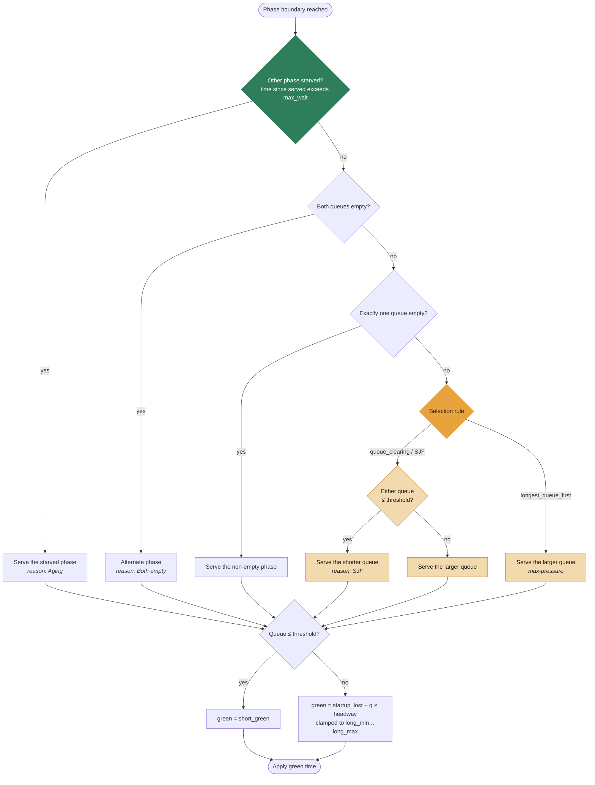
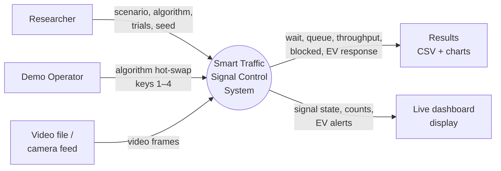
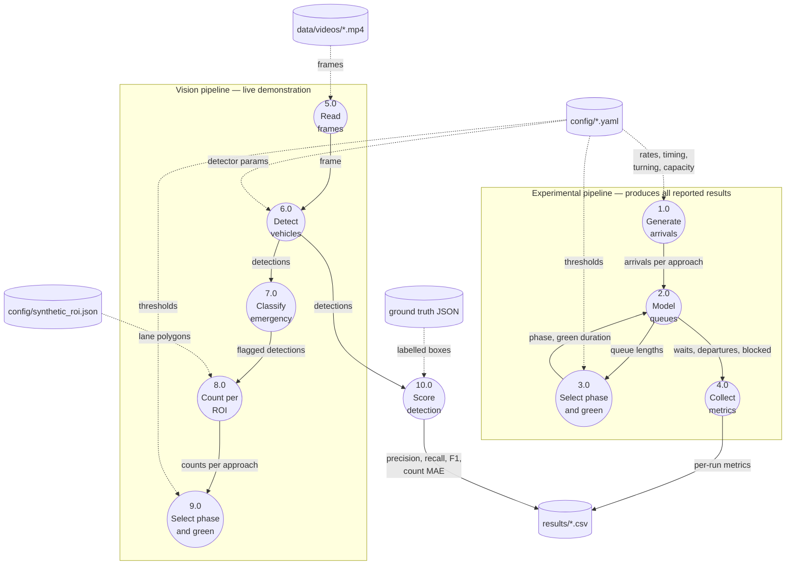

# UML and System Diagrams

Source diagrams for the project report, Chapter Three §3.7 (System Design Tools)
and Chapter Four §4.2 / §4.5 (Architecture and Module Design).

Every diagram is generated from the code as it actually stands, not from the
proposal. Where the two disagree, the code wins and the divergence is noted.

Render these with any Mermaid renderer (mermaid.live, VS Code Markdown Preview
Mermaid, or the published artifact) and export as PNG/SVG for the report.

---

## 3.7.1 Use Case Diagram

Note there is no "motorist" actor. Drivers never interact with this system —
they are the *subject* of measurement, not users of the software. The
emergency vehicle appears as a passive trigger, not an operator.

---

## 3.7.2 Class Diagram — Signal Control

The central design decision in the project. `PreemptiveSchedulingController`
and `EmergencyPreemptionController` are **decorators**: each *is* a
`TimingAlgorithm` and *holds* a `TimingAlgorithm`. That is why emergency
preemption is not a fifth algorithm — it composes over any of the four.

`build_controller()` composes them in a fixed order, `base → preemptive →
emergency`, with emergency outermost so an ambulance can never be interrupted
by the mid-green scheduler.

---

## 3.7.3 Class Diagram — Simulation Pipeline

The pipeline behind every result in the report. `SimEngine` owns the model;
the controller is injected, which is what makes a four-way comparison possible
without touching the model.

---

## 3.7.4 Class Diagram — Detection Pipeline

Separate from the simulation entirely. Both detectors satisfy the same
implicit interface — `detect(frame) -> List[Detection]` — so the dashboard
swaps between YOLO and the colour detector without knowing which it holds.

`EmergencyClassifier` is deliberately a separate collaborator rather than part
of either detector: COCO has no ambulance class, so emergency status is
decided *after* detection, by light-bar heuristic.

---

## 3.7.5 Sequence Diagram — Emergency Vehicle Preemption

One simulation tick in which an ambulance arrives on a red approach. This is
the mechanism behind the 78–86% response-time reduction.

Note `truncate_green` rather than an instant switch: a running green must
serve `min_green_before_preempt` seconds before it can be cut, which is what
real EVP controllers do. Preemption skips the *wait*, never the clearance.

---

## 3.7.6 Activity Diagram — Phase Selection

Drawn for both adaptive controllers at once, because the comparison *is* the
finding. The two rules share every gate except the final one, shaded below.

Under a tight aging bound the first gate fires on nearly every decision, so
the divergent node is rarely reached — which is why `queue_clearing` and
`longest_queue_first` produce identical results at `max_wait_threshold: 20`.
The diagram shows a phase-selection problem that has already been decided
before the selection rule is consulted.

---

## 3.7.7 Data Flow Diagram — Level 0 (Context)

The system has two independent input paths that never meet. Keeping them
separate on the page prevents the most common misreading of this project —
that video drives the experimental results. It does not.

## 3.7.8 Data Flow Diagram — Level 1

---

## Divergences from the proposal

Recorded here so Chapter Three can state them explicitly rather than leaving a
reader to notice the gap.

| Proposal said | System does | Where to address it |
|---|---|---|
| Six modules including an IoT interface | Five modules; IoT not built | §1.6 Scope, §5.6 Future Work |
| YOLOv8 classifies emergency vehicles | Light-bar colour heuristic, applied after detection | §3.7.4, §4.5, §5.2 |
| One "comprehensive adaptive algorithm" | Four comparable controllers plus two decorators | §3.5, §4.5 |
| Single video-driven pipeline | Two independent pipelines | §4.2, §3.7.7 |
| — | Aging bound governs phase selection | §4.10 Results — this is the headline finding |
